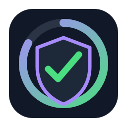

<div align="center">



# dotnet-test-coverlet

**Run .NET tests and produce enforceable coverage reports.**

[](https://github.com/alsi-lawr/dotnet-test-coverlet/actions/workflows/test-action.yml)
[](https://github.com/alsi-lawr/dotnet-test-coverlet/releases/latest)
[](https://codecov.io/github/alsi-lawr/dotnet-test-coverlet)

</div>

This reusable action runs unit tests on a .NET project and generates a code coverage report. It supports configuration for custom test project paths, exclusion of files and modules from coverage, and setting a coverage threshold.

## Usage

Use this action in your workflow by specifying the test project file path, any exclusions for coverage, and the .NET SDK version.

### Inputs

- `project`: **Required**. The path to the directory of the .NET unit test project, or to the `.csproj` file. The path should be relative to the repository root.
- `exclude-files`: **Optional**. Files to exclude from code coverage analysis. Supports glob patterns. Defaults to an empty string.
- `exclude-modules`: **Optional**. Modules to exclude from code coverage analysis. Defaults to an empty string.
- `threshold`: **Optional**. Code coverage threshold percentage. Defaults to `0`.
- `dotnet-version`: **Optional**. The .NET SDK version to use. Defaults to `10.0`.

### Outputs

- `coverage-report-path`: The path to the generated code coverage report directory. This output can be used to chain into other steps, such as uploading the report as an artifact.

### Example

```yaml
name: Run Unit Tests and Generate Coverage

on:
  push:
    branches:
      - main

jobs:
  test:
    runs-on: ubuntu-latest
    steps:
      - name: Checkout repository
        uses: actions/checkout@v3
      
      - name: Run Unit Tests and Generate Coverage
        id: run-tests
        uses: alsi-lawr/dotnet-test-coverlet@v1
        with:
          project: 'src/MyProject.Tests'  # Specify the correct path to your test project directory
          exclude-files: '**/Migrations/*.cs'  # Example: Exclude migrations files
          threshold: 80  # Example: Set coverage threshold to 80%
          dotnet-version: '8.0'

      - name: Upload Coverage Report
        uses: actions/upload-artifact@v3
        with:
          name: coverage-report
          path: ${{ steps.run-tests.outputs.coverage-report-path }}  # Use the output from the previous step to upload the report
```

### Security

- **Sensitive Data**: Ensure that no sensitive data (like API keys or personal information) is included in the test project or output logs, especially when uploading artifacts.

### Chaining with Artifact Upload

This action can be seamlessly chained with an artifact upload step to store the generated coverage report. After running the tests and generating the coverage report, the output `coverage-report-path` can be used in a subsequent step to upload the report as an artifact, making it easily accessible for download and review.

### Additional Notes

- **Dockerized Execution**: This action runs inside a Docker container with the specified .NET SDK version, ensuring a consistent environment for running tests and generating coverage reports.
- **Customization**: You can customize the exclusions and thresholds to suit your project's needs, ensuring that only relevant parts of your codebase are included in the coverage analysis.
- **Microsoft Testing Platform**: When `global.json` sets `test.runner` to `Microsoft.Testing.Platform`, this action pins the Microsoft Testing Platform packages to the latest stable versions, then uses `coverlet.MTP` and the `--coverlet` runner option. `coverlet.MTP` does not currently enforce coverage thresholds, so threshold checks only run on the default `coverlet.msbuild` path.

## Contributing

Contributions are welcome! Please refer to the [contributing guidelines](./docs/CONTRIBUTING.md) for more information.
